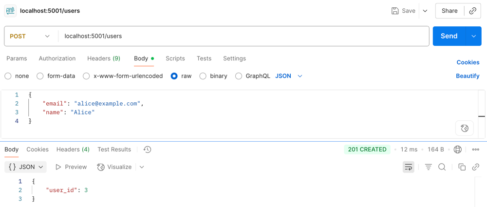
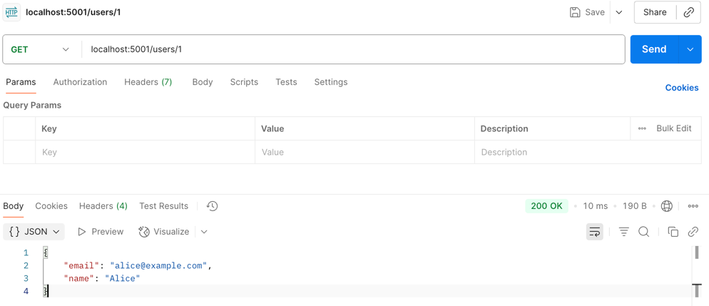
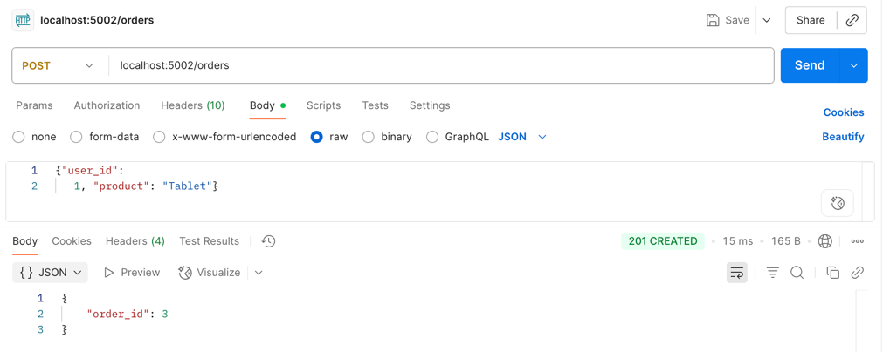
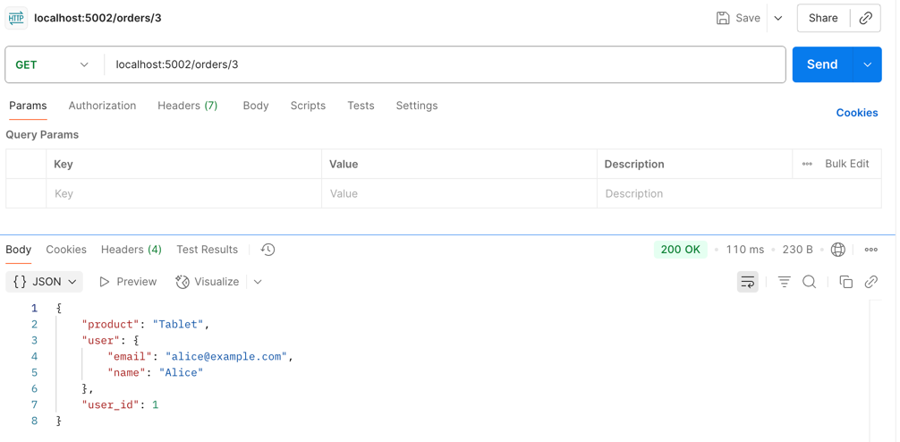
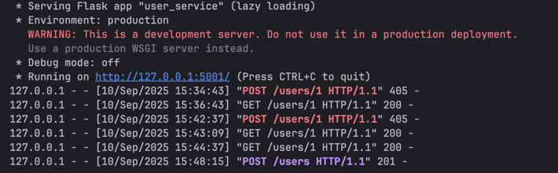
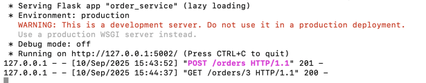

Assignment - 1 
Microservices Architecture

Reference - https://sjsu.instructure.com/courses/1611826/files?preview=83311694

This repository demonstrates a simple microservices architecture using Python and Flask.

It includes two independent services:  
	User Service – Handles user management.  
	Order Service – Handles order management.

The services communicate with each other via HTTP requests, showcasing how microservices interact in a distributed system.

Detailed description of setup and implementation:  

I started by installing the necessary dependencies (Requests and Flask) and setting up a virtual environment for this assignment.  I then made two microservices(as in two different folders in the same repository): an Order Service that runs on port 5002 and a User Service that runs on port 5001.  I was able to communicate with both services using HTTP requests after they were operational(spinned up).  For instance, I could use the User Service to create a new user and then use the Order Service to place an order, which would retrieve the user information from the User Service.  This demonstrated how the two separate services, which were created and implemented independently, interact via REST APIs.

Here are the sample output requests and responses: 

1. Create User 

2. Get User

3. Create Order

4. Get Order

Below are the logs from the application showing the services starting up on their respective ports and successfully handling incoming requests. 

User (5001)  

Order(5002)  

  

